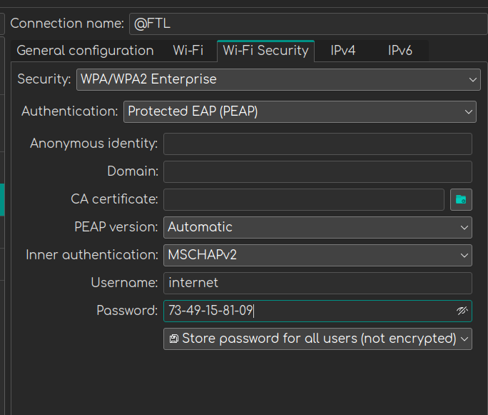

Для начала выставляем такие настройки.

Если не заработало:
1) Останавливаем процессы:
`systemctl stop NetworkManager.service wpa_supplicant.service`

2) `sudo nano /etc/wpa_supplicant/wpa_supplicant.conf`

туда вставляем
`openssl_ciphers=DEFAULT@SECLEVEL=0`

3) `sudo nano /usr/lib/systemd/system/wpa_supplicant.service`

В строчке ExecStart добавляем если нет
`-c /etc/wpa_supplicant/wpa_supplicant.conf`

4) `sudo nano /etc/NetworkManager/system-connections/@FTL.nmconnection`

ниже `[802-1x]`

Добавляем `phase1-auth-flags=32`

Перезагружаем систему
